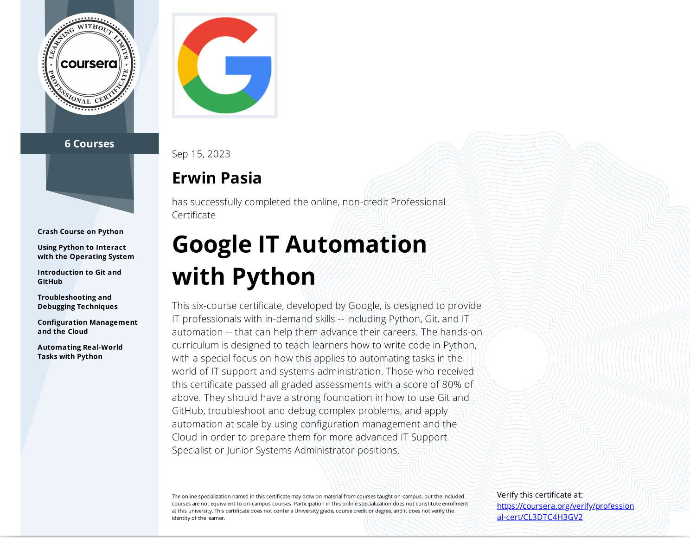

# [Google IT Automation with Python Professional Certificate's Automation Project](https://www.credly.com/badges/47116441-c734-4380-b36e-36c4eab41073) - COMPLETED!

The Google IT Automation with Python Professional Certificate's Projects are designed to enhance your IT skills by teaching you how to use Python for automation, manage systems using Git and GitHub, and apply these skills in cloud environments. These projects provide practical experience aimed at preparing you for advanced roles in IT support or systems administration.

## **Project Overview**

### **Objective**

The projects within this certificate aim to equip learners with the ability to automate system administration tasks using Python, manage version control with Git and GitHub, troubleshoot and debug complex issues, and implement automation solutions at scale using cloud technologies.

### **Technical Skills Development**

The program involves several key components that mirror real-world IT tasks:

- **Python Programming:**
    - Learn Python from scratch, focusing on writing scripts to automate repetitive system administration tasks.
    - Develop skills in handling files, managing processes, and parsing logs using Python libraries.

- **System Administration Automation:**
    - Use Python scripts to automate routine tasks such as user account management, system monitoring, and data backup.
    - Implement scheduling of automated tasks using cron jobs or similar tools.

- **Version Control with Git and GitHub:**
    - Understand the fundamentals of version control systems.
    - Use Git for tracking changes in scripts and configurations.
    - Collaborate on projects using GitHub, managing repositories, branches, and pull requests.

- **Troubleshooting and Debugging:**
    - Develop strategies for identifying and resolving issues in IT systems.
    - Use debugging tools and techniques to fix errors in scripts and configurations.

- **Automation at Scale:**

    - Learn about configuration management tools like Puppet or Ansible for deploying automation across multiple systems.
    - Explore cloud services to implement scalable automation solutions, leveraging platforms like Google Cloud.

### **Tools and Techniques**

- **Programming Language:**
    - *Python* for scripting and automation tasks.

- **Version Control Systems:**
    - *Git* for managing code changes.
    - *GitHub* for collaboration and repository hosting.

- **Configuration Management:**
    - Tools like Puppet or Ansible for automating deployment across systems.

- **Cloud Platforms:**
    - Google Cloud or similar services for implementing cloud-based solutions.

### **Outcome**

By completing these projects, students gain hands-on experience in automating IT tasks using Python, managing projects with Git and GitHub, troubleshooting complex issues, and applying automation at scale. This practical knowledge prepares them for roles such as advanced IT Support Specialist or Junior Systems Administrator.

The Automation projects allow students to apply their skills to solve a real-world IT problem, demonstrating their ability to implement effective automation solutions. Completing this certificate provides a strong foundation in IT automation, making graduates attractive candidates for potential employers seeking skilled professionals in the field of IT Automation Engineering.

## [Credly Professional Badge Of Competency:](https://www.credly.com/badges/47116441-c734-4380-b36e-36c4eab41073)

    

